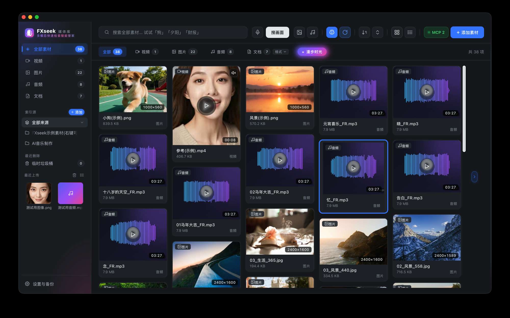
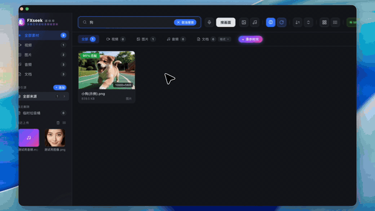
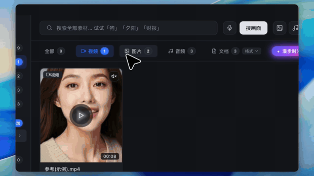
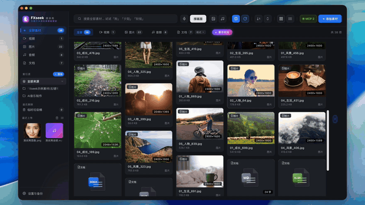
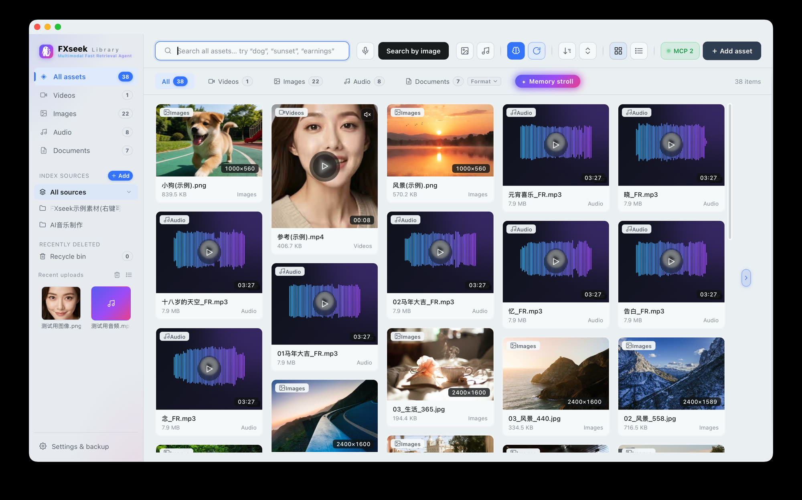
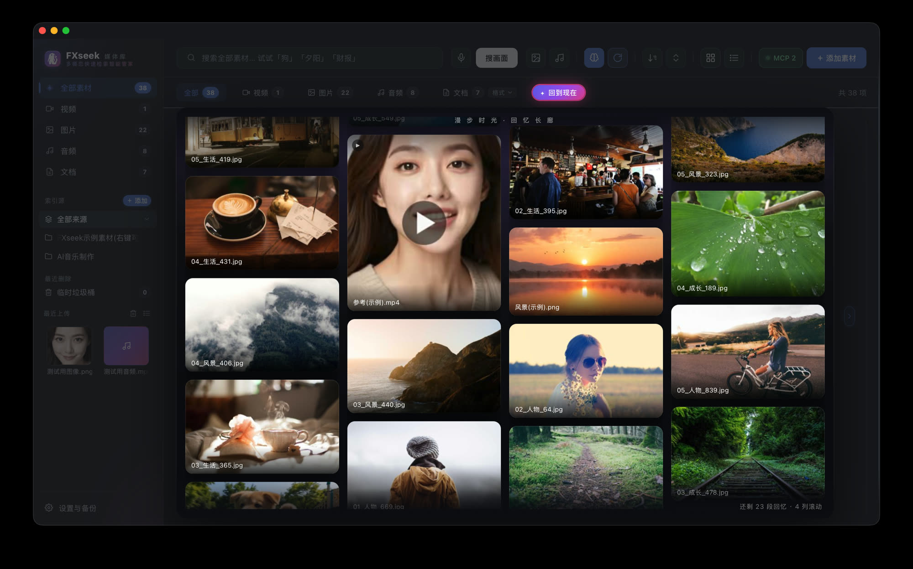

# FXseek

**A self-contained, fully local media library for macOS — find the photos, videos, audio and documents on your disk by describing them, by speaking (or humming), or by showing it a reference image.**

Indexing, tagging and transcription all run **on your own machine**; nothing leaves it. There is no Python to install and no dependency to manage — the app ships with its own runtime and a built-in multimodal model.

**English** · [简体中文](docs/README.zh-CN.md)

```
"a picture with balloons"     → finds that photo, and tells you why it matched
hold to speak "find the dog"  → voice → intent → search
hum a chorus                  → acoustic fingerprint pinpoints that track
drop in a reference image     → similar assets; videos jump to the matching frame
```

---



## Three demos

**① Search by describing the picture** — type "dog" or "knitwear"; results carry a **match score**, and double-clicking the search box brings up your history:


▶ [Full demo · 45 s (with audio, 1600×900)](../../releases/download/v1.0.3/FXseek-search-demo.mp4)

**② Make it yours** — light / dark theme and 简体中文 / English switch in one click; thumbnail wall, list view and detail pane whenever you want them:


▶ [Full demo · 22 s (with audio)](../../releases/download/v1.0.3/FXseek-ui-tour.mp4)

**③ Memory Lane** — an ambient gallery that keeps only photos and videos, drifting slowly in staggered columns; click any tile and it fades away:


▶ [Full demo · 30 s (with audio)](../../releases/download/v1.0.3/FXseek-memory-lane.mp4)

> The full videos (with audio, 1600×900) live in [Releases](../../releases) next to the installer.
> The GIFs are downscaled to 620px for load time — see the videos above, or the stills below, for detail.

### Stills (easier on the eyes)

| Light theme · English | Memory Lane |
|---|---|
|  |  |

## What it does

| | Capability |
|---|---|
| 🔍 **Search by describing the picture** | Not just filenames: vector search understands *what is in the frame* ("water at sunset", "sweat on a palm"), then re-ranks. |
| 🎙 **Voice search** | Hold a key, say what you want. **Humming** goes through an acoustic fingerprint (Chromaprint). Fingerprint first, intent routing, two fallbacks. |
| 🖼 **Search by image / by audio** | Hand it one picture or one clip and get similar assets back; when it hits a video, the cover *is* the matching frame. |
| 🗂 **30+ formats** | 8 image, 8 video, 8 audio formats, plus PDF / Office / WPS / plain text / archive listings. |
| 🎬 **More than search** | Thumbnail wall, built-in player, recent uploads, trash. |
| 📜 **One transcript panel, audio and video alike** | The player has a collapsible **Transcript** panel — audio calls it the lyric view, video slides it out beside the picture (and the video actually *gives up width* rather than hiding text behind it). Same component, so both get the *Original / Polished* switch, *Re-polish*, *Re-transcribe* and *Revert*. The video **subtitle overlay** is driven from the same transcript, so polishing updates the subtitles too. The right-hand detail pane is read-only: it shows the text and points you at the player instead of stacking a row of buttons. |
| 🪄 **AI polish for transcripts** | Transcription is never perfect. Hand a transcript to your local chat model and it *fixes typos, restores punctuation, and labels who is speaking* — songs get lyrics treatment, interviews get `Speaker A:`. **The original is always kept**: the polished text sits beside it, both are searchable, and one click reverts. "Polish all" has an **idle gate** (on by default): it waits until you have stopped using the app for `idle_minutes`, pauses the moment you come back, and picks up where it left off — so it never fights your keyboard for the GPU. |
| ✨ **Memory Lane** | A one-click "corridor of memories": photos and videos only, drifting in staggered columns; click one to let it fade out. |
| 🤖 **Hook it up to local AI agents** | A built-in MCP server, with one-click detection and setup for 6 agents (DSH, Codex, Claude Code, …). |
| 🌗 **Everyday comfort** | Bilingual UI, light/dark themes (optionally following the time of day), index-source management, a local HTTP API. |
| 🔄 **Update check** | *About → Check for updates* compares your build against GitHub Releases. If it can't reach GitHub (offline, blocked, rate-limited) it says so plainly and reveals a **releases** button that opens the page in your browser — it never fakes a "you're up to date". |
| 🪶 **Light on memory** | The ~3.5 GB multimodal model is **loaded on demand** — launching the app costs a few tens of MB, not gigabytes, so an 8 GB Mac stays responsive. It loads on your first search (a second or two) and is **released again after it has been idle** (default 5 min, configurable); searching repeatedly within that window reuses the one copy. |

> The quiet but important part: **not a single search request ever leaves this machine.** The bundled
> WeMM-Embedding-2B model runs locally, and transcription only ever talks to the local or self-hosted
> service *you* point it at.

## Download

1. Grab `FXseek-1.0.3.dmg` from [Releases](../../releases)
2. **Delete any older copy first**: `/Applications/FXseek.app` (installing over it leaves stale files behind)
3. Open the dmg and drag `FXseek.app` into *Applications*
4. On first launch it **downloads the built-in model (~1.8 GB)** automatically, with a progress bar; it tries a mirror first and falls back to the official source
5. The app is not notarised by Apple, so if Gatekeeper blocks the first launch, **right-click → Open** (or allow it under *System Settings → Privacy & Security*)

**Requires**: Apple Silicon (M-series) + macOS 13 or newer. Verified on an Apple M4.

### Downloading from mainland China

GitHub's release CDN can be slow or unreachable there. These mirrors serve the exact same file:

| Route | Link |
|---|---|
| ⚡ Mirror 1 | `https://ghfast.top/https://github.com/FRr688/FXseek/releases/download/v1.0.3/FXseek-1.0.3.dmg` |
| ⚡ Mirror 2 | `https://hk.gh-proxy.com/https://github.com/FRr688/FXseek/releases/download/v1.0.3/FXseek-1.0.3.dmg` |
| ⚡ Mirror 3 | `https://ghproxy.net/https://github.com/FRr688/FXseek/releases/download/v1.0.3/FXseek-1.0.3.dmg` |
| 🌐 Direct | `https://github.com/FRr688/FXseek/releases/download/v1.0.3/FXseek-1.0.3.dmg` |

The mirrors are third-party proxies — they may be unavailable at any time. If none of them work, try the
direct link, or use any GitHub accelerator you trust by prefixing it to the direct URL.

**File integrity** (283.6 MB / 297,394,752 bytes):

```bash
shasum -a 256 ~/Downloads/FXseek-1.0.3.dmg
# 3035320aeeaa016260153a54aac27c6918ad961f1e2d56be3b19385bcf46729c
```

## Building from source

The repository holds **source only**. To build a runnable `.app` / `.dmg` you need three things in the
repository root — `venv/`, `bin/` and `model/` — all of which are `.gitignore`d.
**Full step-by-step instructions, including two pitfalls we actually hit**, are in
→ [docs/building.md](docs/building.md).

```bash
bash tools/build_app.sh          # .app only
bash tools/build_app.sh --dmg    # .app + .dmg
hdiutil verify dist/FXseek-1.0.3.dmg     # must print VALID

# Dev mode: run the server directly; edits to ui.html / settings.html apply on refresh
./venv/cpython-3.11/bin/python3.11 app.py --port 8231

# Dependency audit (run this before touching the packaging slim-down list)
./venv/cpython-3.11/bin/python3.11 tools/audit_deps.py
```

## Project layout

| Path | What it is |
|---|---|
| `app.py` | HTTP server + web UI + search API (stdlib only; the front end is re-read from disk per request, so edits apply on refresh) |
| `indexer.py` / `fastsearch.py` | Index construction + three-stage retrieval (filename → vectors → deep re-rank) |
| `embed.py` / `serve.py` | Model loading and self-check / OpenAI-compatible local embedding service |
| `voice_intent.py` / `fingerprint.py` / `recorder.py` | Spoken-intent classification (pure numpy), acoustic fingerprinting, microphone capture |
| `model_dl.py` | First-launch model download (two sources, resumable, with progress) |
| `mcp_server.py` / `mcp_agents.py` / `fxseek_skill/` | Exposes the library to local AI agents |
| `launcher.py` / `tray_helper.py` | Native launcher (Mach-O, so microphone permission is attributed correctly) and menu-bar helper |
| `ui.html` / `settings.html` / `i18n.js` / `icons.js` | Front end (no build step, plain JS) |
| `tools/` | Packaging scripts, dependency audit, native launcher source, sample-asset generator |
| `docs/` | [Building guide](docs/building.md) · [engineering notes](docs/手册.md) *(Chinese)* · [demo assets](docs/demo/) |

## Troubleshooting

The most common failures, their root cause, and the release that fixed them. More detail lives in the
[engineering notes](docs/手册.md) *(Chinese)*.

| Symptom | Root cause | Fixed in |
|---|---|---|
| Background transcription stops dead, and **one failed file halts the whole queue** | A service-wide outage (connection failure / 504 / timeout / `database is locked`) was recorded against each individual file, so 200 pending jobs each got blacklisted and the queue froze | **1.0.3** |
| Transcription of a local model (oMLX / Ollama / LM Studio) fails with `504` or a timeout | The request went through the **system proxy** (dev-sidecar, corporate proxy, accelerators) while the model lives on `127.0.0.1`. Short requests survive; long audio uploads get cut by the proxy's own 60-second timeout | **1.0.2** |
| One song takes **minutes to transcribe**, or the result is a wall of repeated lyrics | The local ASR falls into a repetition loop and never stops, generating up to the `max_tokens` ceiling (measured: 130–220 s for a single window) | **1.0.3** |
| Want **subtitles** on a video and can't find a switch | The player now has a *Subtitles* toggle: with a transcript it shows/hides the overlay; without one it turns into "Transcribe this video" | **1.0.3** |
| The version shown in *About* doesn't match the installer (stuck on v1.0.0) | The version had been persisted alongside user settings, and saving never updated it — so the stale value in the data directory shadowed the real one | **1.0.3** |
| The **menu-bar icon disappears** after a while | Liveness probes went through the system proxy (false "service is dead"); the self-exit code was 0 while the restarter only accepts 2 (so it never came back); and a leftover command file from the previous session was replayed, quitting the app | **1.0.3** |
| Fine from source, but a packaged `.app` fails *Test connection* with `No such file or directory: 'ffmpeg'` | Double-clicked apps launch via LaunchServices with `PATH=/usr/bin:/bin:/usr/sbin:/sbin`, so a bare `subprocess.run(["ffmpeg", …])` misses the bundled `bin/ffmpeg` | Always resolve binaries via `indexer._find_bin()` |
| **Reverting an AI polish changes nothing** — the panel keeps showing the polished text even though the database no longer has it | `probe_media_meta()` handed callers the *shared cached dict*, and the detail endpoint merged index fields into it in place. The mutation stuck in memory (and was later flushed to the on-disk cache), so deleted fields kept being served | 1.0.4 — the probe entry point now returns a copy |
| The packaged `.app` **dies on launch**, source runs fine | `tools/build_app.sh` copies Python files from an explicit whitelist, and a newly added module (`asr_polish.py`) was missing from it while `app.py` already imported it → `ImportError` before the window ever appears | Fixed the whitelist, **and** the build now *scans every entry script's imports* and refuses to build when a local module would be left out |
| The video player's transcript panel **overlaps its own title**, or polishing the text leaves the **subtitles stale** | Two separate bugs from the same feature: the 384 px panel kept the header's absolutely-positioned tool group on the same line as the centred title (it needs ~300 px of a 332 px content box, so they collided) — now the header stacks in narrow panels, audio included; and the subtitle overlay reloaded only from its own old controls, so it had to be re-pointed at the transcript component (`box._mvSubReload`) and refreshed from *every* mutator (*re-polish*, *re-transcribe*, *revert*) | **1.0.4** |
| Running **polish-all + tagging + transcription together** hammers the machine | `_POLISH` was an independent flag from `busy` / `ai_tagging` / `asr_running`, so jobs happily piled onto the same GPU and memory | All heavy jobs now share one gate: `_heavy_running()` makes each entry point refuse with *"…is running, wait for it to finish"*, and polish-all additionally waits for **idle_minutes** of no user activity |
| Tagging / transcription that uses an **official (remote) API** still blocks polish-all and fill-in | `_heavy_running()` only asked *whether* a job was running, never *where the model runs*. A remote API costs almost no local memory or GPU, so blocking other jobs on it just made them sit idle for nothing | Jobs are now classified by where the model lives — `_is_local_url()` splits `127.0.0.1` / `localhost` from everything else. Remote tagging or transcription no longer counts as heavy work; a **local** (oMLX / Ollama) one still does. The idle reaper uses a *separate* predicate, `_model_in_use()`: even a remote-API tagging job still needs WeMM to encode its vectors, so the model is never unloaded out from under it |
| **Check for updates** always fails with `CERTIFICATE_VERIFY_FAILED: unable to get local issuer certificate` | On machines behind a TLS-intercepting proxy/VPN (the peer certificate here was issued by *Sectigo Public Server Authentication CA DV E36*), Python's OpenSSL trusts only certifi / the openssl CA directory and **never reads the macOS keychain**. `certifi`, `/private/etc/ssl/cert.pem` and `load_default_certs()` all failed, while `curl` returned HTTP 200 from the same host at the same moment | Fetch GitHub through `/usr/bin/curl`, which does use the keychain. Two related traps: `releases.atom`'s `<entry><title>` is the **release title** ("FXseek 1.0.3"), not the tag — take the tag from the `/releases/tag/…` link or every version parses as `0.0.0`; and prerelease-suffixed versions must sort *above* the plain release of the same number (`1.0.4test11` → `(1,0,4,0,"test11")` beats `1.0.4` → `(1,0,4,1,"")`) |
| `unload_model()` returns in 0.04 s, so the memory must already be free — right? | The call only drops references; MLX/Metal hands the pages back **asynchronously** over the next couple of seconds. Measuring right after the call shows ~2 GB still resident and makes a working feature look broken | Measure the process `footprint` a few seconds later — 2337 MB → 310 MB. Also: hold no reference to the model, or `unload` frees nothing at all |
| A menu-bar item's **colour is ignored** — the MCP panel was set to black, the "server: running" line to green, and both still rendered grey | **AppKit dims every disabled menu item as a whole, and an explicit `labelColor` in the attributed title does not override it.** Verified side by side on a real popup menu: *disabled + labelColor* renders grey, *enabled + labelColor* renders black, and **bold survives in both** — so only the colour was ever being eaten, which is why an earlier "bold + labelColor" fix looked like it had done nothing. The custom-view route (`setView_(NSTextField)` on a disabled item) is not part of that dimming pass, so the colour finally sticks while the row stays unclickable and does not highlight blue on hover | **1.0.5** — `_strong_item()` (a disabled item whose title is a non-editable `NSTextField`). Two traps: `boldSystemFontOfSize_(0)` returns **13 pt** while `menuFontOfSize_(0)` is **14 pt**, so hard-coding the bold size makes the highlighted row a size smaller than its neighbours — read the menu font and take the bold of *that* size; and re-measure the text field's width after every text change, or a longer status string gets clipped |
| **In English mode a sentence stays Chinese** even though the string is in the dictionary | `translate()` strips only the **leading and trailing** whitespace of a text node before lookup, so a string built from a template literal with an embedded `\n` and indentation never matches its entry. Interpolated values make it worse: the parenthetical variant is a runtime variable, so no single dictionary key can cover all four forms | **1.0.5** — match those with a `RULES` regex plus a replacement function (the capture group maps to the right English parenthetical) rather than trying to enumerate dictionary entries. Anything with internal newlines belongs in `RULES`, not `ZH2EN` |
| `footprint` vs `ps` on Apple Silicon | `ps -o rss` under-reports Metal/unified-memory allocations by two orders of magnitude (a 3.5 GB process shows 19 MB) | Use `/usr/bin/footprint -p <pid>` (`phys_footprint`) for anything MLX-related |

> A rule of thumb for **intermittent** failures like these: **first check that the causality in the log is
> the causality you assume.** `FXseek.log` has no timestamps on its lines, so we had to reconstruct the
> ordering from the adjacent HTTP access lines — that is how we found that the "tray decided the service
> was dead" lines sit directly beneath `GET /health 200`.

## License (important)

- This project is released under the **PolyForm Noncommercial License 1.0.0** ([LICENSE](LICENSE)):
  free to use and modify for **personal study, research, hobby projects, charity, education, public
  research and government** use.
- **Any commercial use requires a separate license** (internal company use, shipping it with a product,
  SaaS, contract development, …) → see **[COMMERCIAL.md](COMMERCIAL.md)** for terms and pricing.
- Licenses for bundled and third-party components and models are listed in **[THIRD-PARTY.md](THIRD-PARTY.md)**
  — check it before distributing, especially for FFmpeg, Chromaprint and the bundled model.

---

[简体中文文档 →](docs/README.zh-CN.md)
